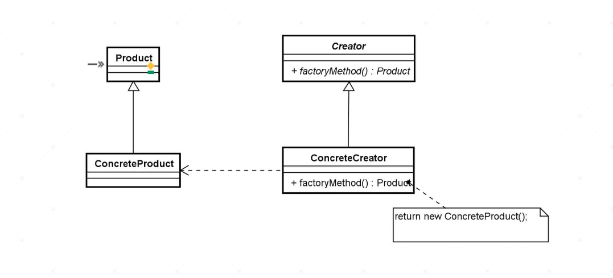

# factory-method-impl

## Descrição
O propósito para a desenvolvimento desse projeto é apresentar um modelo simples para estudo e compreenção do modelo Factory Method com contexto geral em relação a padrões de projeto em Java.

### Factory Method
O **padrão Factory Method** é um dos padrões de criação de objetos que fazem parte do catálogo do *Design Patterns* descrito pela "Gang of Four" (GoF). O objetivo principal desse padrão é fornecer uma maneira de criar objetos sem especificar a classe exata dos objetos que estão sendo criados.

> **Factory Method** é um padrão frequentemente utilizado na implementação de frameworks !

### Definição do Padrão Factory Method

O Factory Method é utilizado para **delegar a criação de objetos** para subclasses. Ou seja, em vez de instanciar diretamente os objetos utilizando o operador `new`, ele oferece uma interface para criar objetos, mas permite que as subclasses decidam qual classe instanciar.

###  O Problema que o Padrão Factory Method Resolve

Imagine que você tenha uma classe que cria diferentes tipos de objetos, mas você não sabe antecipadamente qual objeto deve ser criado, ou que tipo de objeto pode ser necessário em tempo de execução. Se você simplesmente instanciar os objetos diretamente, sua aplicação fica rígida, difícil de manter e testar, além de quebrar o princípio de **aberto/fechado** do SOLID (aberto para extensão, fechado para modificação).

Com o Factory Method, você pode deixar a lógica de criação de objetos para as subclasses, fazendo a classe principal seguir o princípio de aberto/fechado.

### Estrutura do Padrão Factory Method
**Creator (Criador)**: Classe abstrata ou interface que declara o método de fábrica (`factoryMethod()`). O objetivo dessa classe é definir o método que será usado para criar objetos, sem especificar exatamente que classe será instanciada.

**ConcreteCreator (Criador Concreto)**: Subclasse que implementa o `factoryMethod()` e define qual tipo de objeto concreto será criado.

**Product (Produto)**: Interface ou classe abstrata que define o comportamento do objeto que será criado.

**ConcreteProduct (Produto Concreto)**: Implementação específica do produto que será criado pelas subclasses concretas do `Creator`.

Na imagem a seguir, você pode observar que a estrutura geral da solução proposta pelo padrão Factory Method define quatro participantes:

<picture>
    
</picture>

Do lado esquerdo, estão os produtos a serem fabricados. O participante **Product** corresponde ao tipo genérico do elemento a ser fabricado, enquanto **ConcreteProduct** corresponde a cada especialização do produto a ser fabricado.

Do lado direito, estão os criadores, isto é, as classes que são responsáveis pela instanciação dos produtos. O participante **Creator** define uma operação (**factoryMethod**) que retorna uma instância da interface genérica **Product**, enquanto **ConcreteCreator** representa cada implementação concreta de **Creator** responsável pela instanciação do **ConcreteProduct** específico.

### Consequências e padrões relacionados ao Factory Method

O padrão **Factory Method** permite que diferentes implementações de um mesmo serviço possam ser utilizadas por um cliente sem que seja necessário replicar códigos similares ou utilizar estruturas condicionais complexas, conforme ilustrado no exemplo anterior.

Além disso, esse padrão possibilita a conexão de duas hierarquias paralelas representadas pelos participantes genéricos **Creator** e **Product**.

> O **Factory Method** é muito útil quando precisamos segregar uma hierarquia de objetos detentores de informações (objetos de domínio) dos diferentes algoritmos de manipulação dessas informações.

Portanto, esse padrão pode ser aplicado em conjunto com o padrão Strategy, que tem como objetivo a separação de diferentes algoritmos dos objetos de domínio sobre os quais eles atuam.

